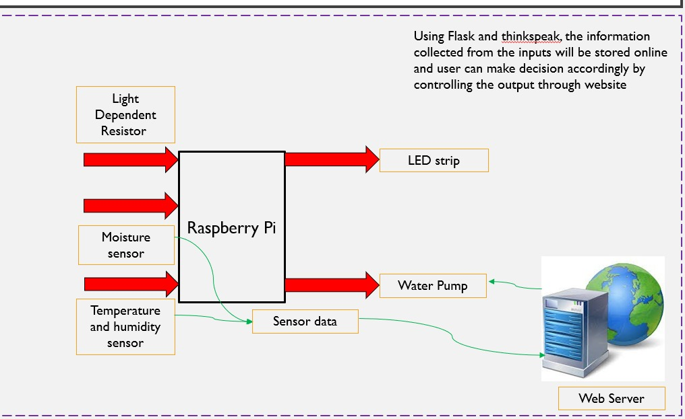
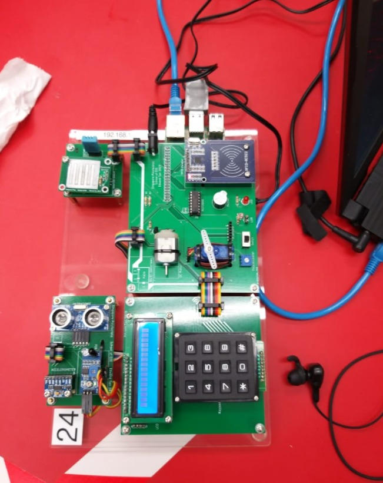

# Description
Remote plant watering system using flask & thingspeak.
<!-- <h1> Description <h1> -->

# Block Diagram 
 


# How to deploy
 The following make use of flask to control water pump and display the statstics in the form of various form of graphs
 

  # Pre-requisites 
- A thinkspeak account 
- A raspberry pi 
- python IDLE 
- various electrical components listed
    - Buzzer
    - LED
    - SG90 Servo motor
    - LDR
    - DHT11
    - Moisture sensor
    - An ADC chip for RASPBERRY PI
 <!--<p align = "center" > for aligning images-->  
 # Things to take note
  Raspberry pi has to be configured properly before use 
 
 Running https://jacktan130802.github.io/ will give you a stimulation of how the website will look like.IIt will give errors as the python file **are absent**. To run the complete file, run the full zip file webapp folder (download the folder.)
<!-- copy paste exact link inside can already--!>


<!--<div align="center">  </div>
<!-- copy paste image to issue and get this link from there -->

# Set-Up
 

<br>
<br>


```diff
- My Raspberry Pi
```


# To use
To run and use the whole code, download the **Webapp 2.0** folder. `Web_plants.py` is the main code to be runned. Run the `web_plant.py`. The files at the main branch is just for github.io. <b>IGNORE IF NOT USED </b> (Use the webapp folder)


Note: Everytime you want to run the flask , remember to to a reset to the tcp/ip. The command to reset will be `fuser -k 5000/tcp`
